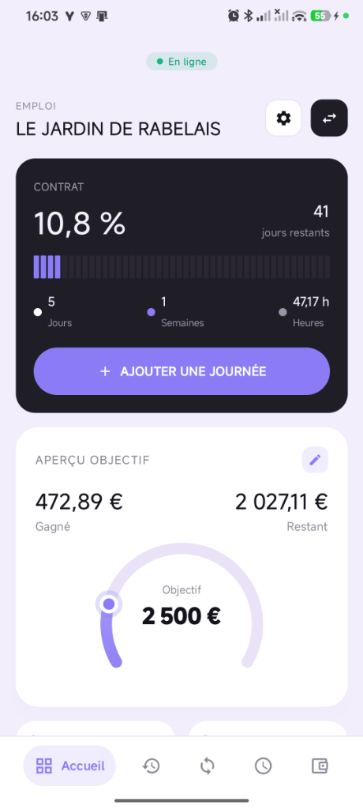
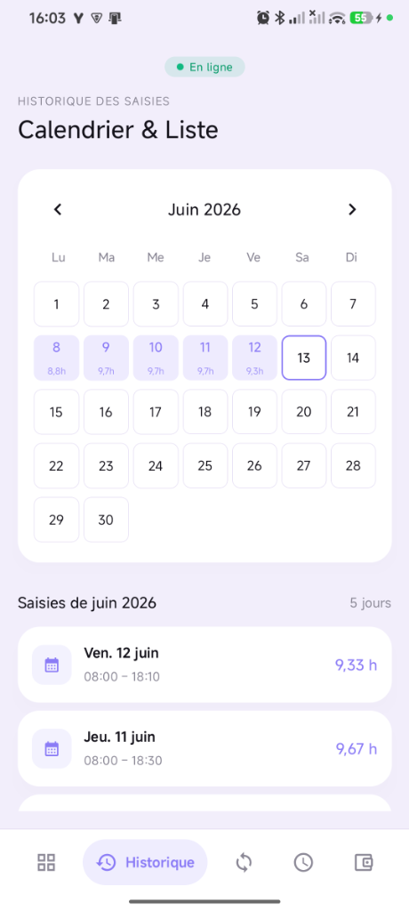
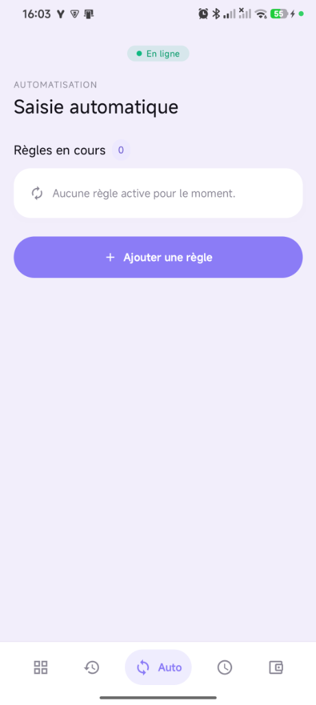
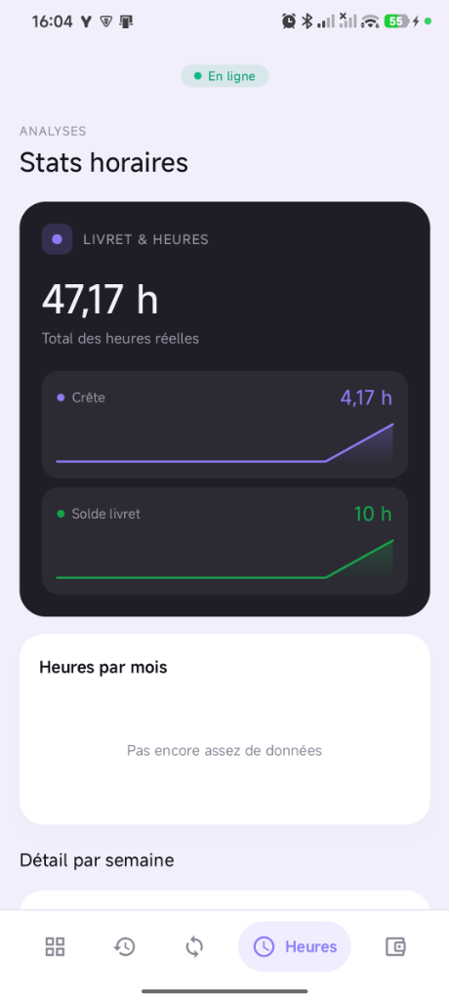
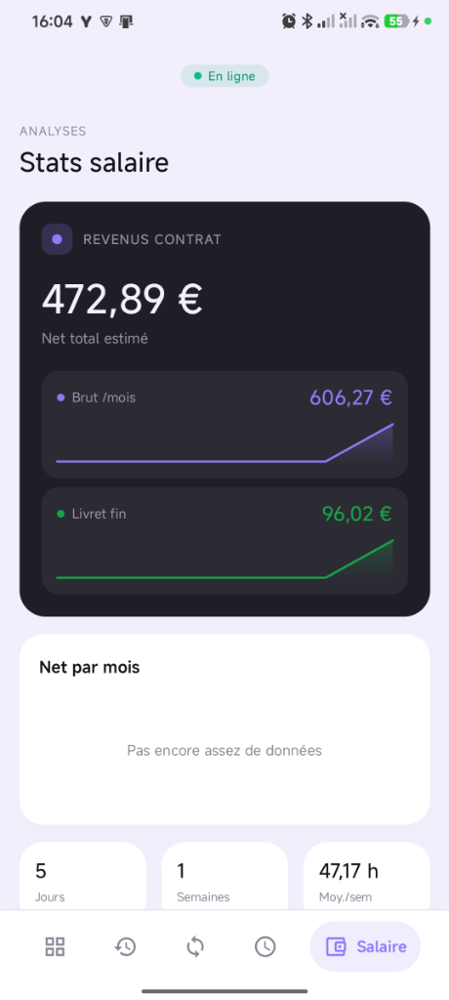
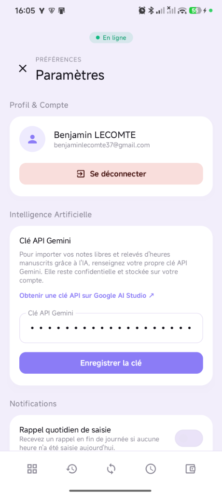
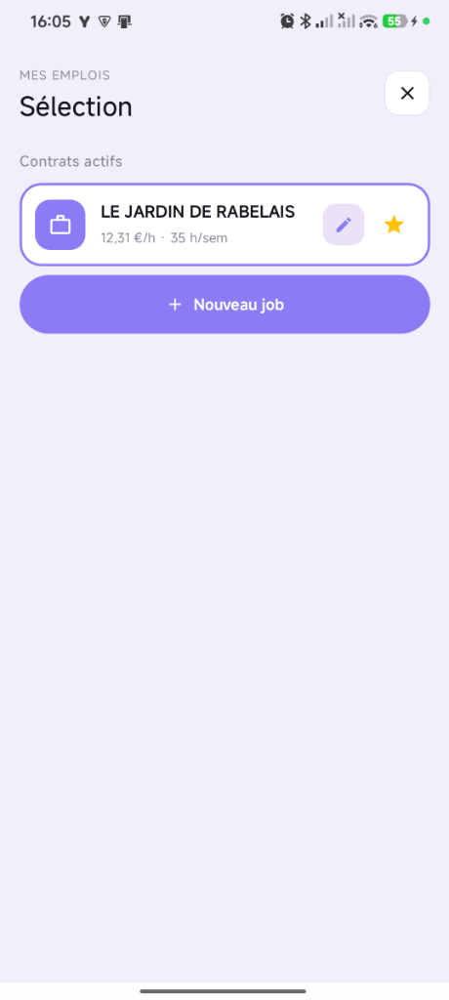

# SalaryTracker ⏰

**SalaryTracker** est une application Android moderne et performante conçue pour suivre vos heures de travail, estimer votre salaire mensuel (brut et net) en temps réel, et comparer ces estimations avec vos bulletins de paie réels pour détecter tout écart ou sous-paiement.

L'application intègre des technologies d'Intelligence Artificielle (Gemini API) pour faciliter la saisie automatique à partir de notes ou d'importation de documents, le tout enveloppé dans une interface utilisateur fluide, animée et haut de gamme.

---

## 📸 Aperçu & Fonctionnalités de l'application

| Écran / Fonctionnalité | Rendu Visuel |
| :--- | :---: |
| ### 📊 Tableau de Bord Général<br><br>Votre hub principal affichant la progression de votre contrat en cours (jours, semaines et heures réelles travaillées), vos objectifs de gains mensuels avec une jauge animée haut de gamme, et des actions rapides d'ajout. |  |
| ### 📅 Historique Interactif Dédié<br><br>Visualisez vos journées travaillées et vos congés sous forme de grille mensuelle interactive de style calendrier. Un résumé des saisies mensuelles est disponible sous la grille avec raccourcis d'édition rapides. |  |
| ### 🤖 Saisie Automatique & Règles<br><br>Configurez des règles de génération intelligente pour renseigner automatiquement vos heures de travail récurrentes sur les journées cibles sans action manuelle répétitive. |  |
| ### 📈 Statistiques Horaires<br><br>Analysez votre répartition horaire au cours des derniers mois. Affiche le total de vos heures réelles travaillées, vos heures supplémentaires (crête) accumulées et le solde courant de votre livret d'heures. |  |
| ### 💵 Statistiques Financières<br><br>Suivez vos gains nets cumulés estimés. L'application évalue vos revenus à venir et vous permet de comparer en un clic vos estimations avec vos bulletins de paie importés. |  |
| ### ⚙️ Paramètres & Intelligence Artificielle<br><br>Gérez vos préférences utilisateur, changez l'icône de l'application, configurez les rappels de notifications quotidiens intelligents, ou renseignez votre clé API Gemini pour l'OCR intelligent de vos fiches de paie. |  |
| ### 💼 Sélection Multi-Contrats<br><br>Gérez l'ensemble de vos contrats actifs de façon cloisonnée. Les contrats passés ou terminés peuvent être facilement archivés d'un clic pour conserver une vue dégagée. |  |

---

## 🛠️ Stack Technique

*   **Langage** : Kotlin
*   **UI Framework** : Jetpack Compose (Material 3) avec animations fluides de transition et d'onboarding.
*   **Base de données & Auth** : Firebase (Authentication & Realtime Database) pour une synchronisation multi-appareils fluide et sécurisée.
*   **Intelligence Artificielle** : Google Gemini API (via SDK Client officiel) pour l'OCR de fiches de paie et la structuration des saisies libres.
*   **Architecture** : MVVM (Model-View-ViewModel) robuste avec gestion d'état réactive (StateFlow/Lifecycle).

---

## 📦 Compilation & Installation locale

### Prérequis
- Java JDK 17+
- Android SDK (API 26+)

### Compiler l'APK de Test (Optimisé)
Vous pouvez générer une version Release optimisée (minifiée par R8/Proguard pour éliminer tout lag d'animation) et signée avec la clé debug :

```bash
./gradlew assembleRelease
```
L'APK généré sera disponible sous :
`app/build/outputs/apk/release/app-release.apk`

---

## 📄 Licence

Ce projet est distribué sous licence libre d'utilisation à des fins de test et de formation.
