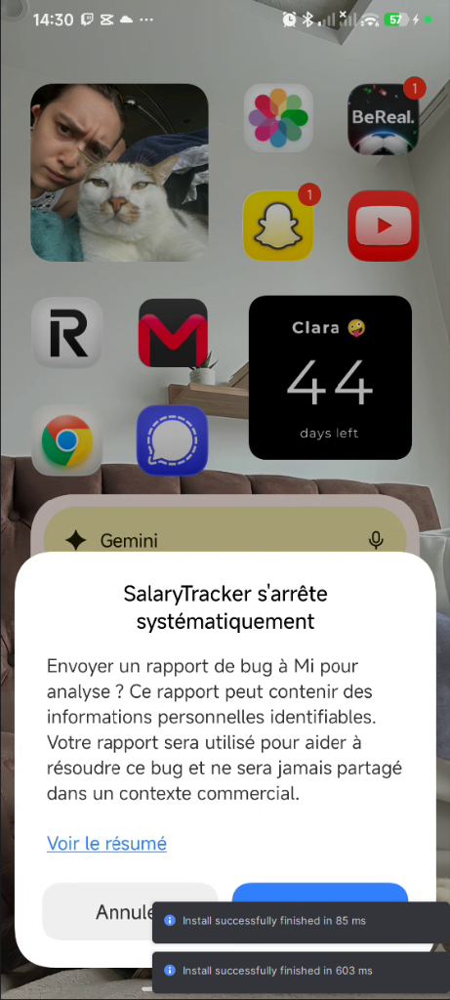
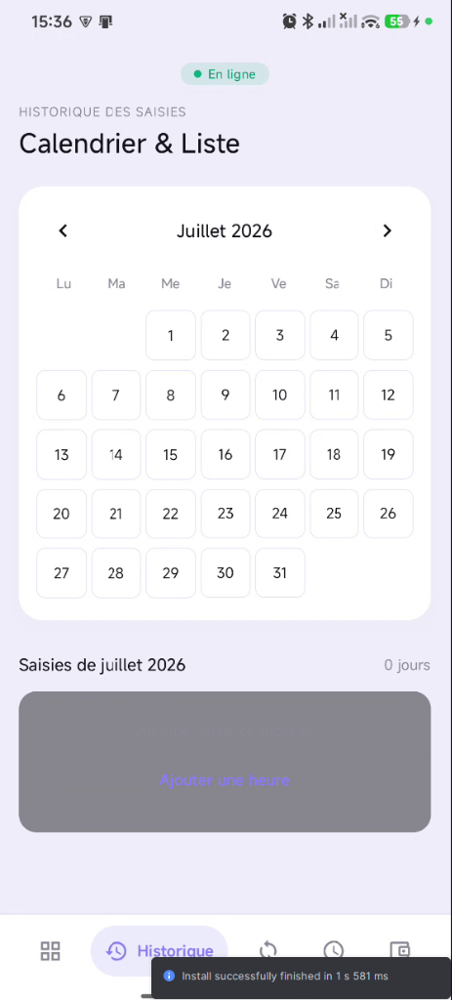
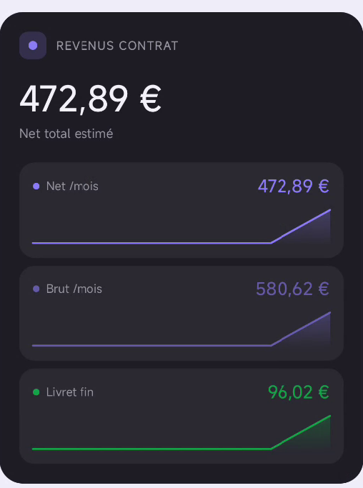
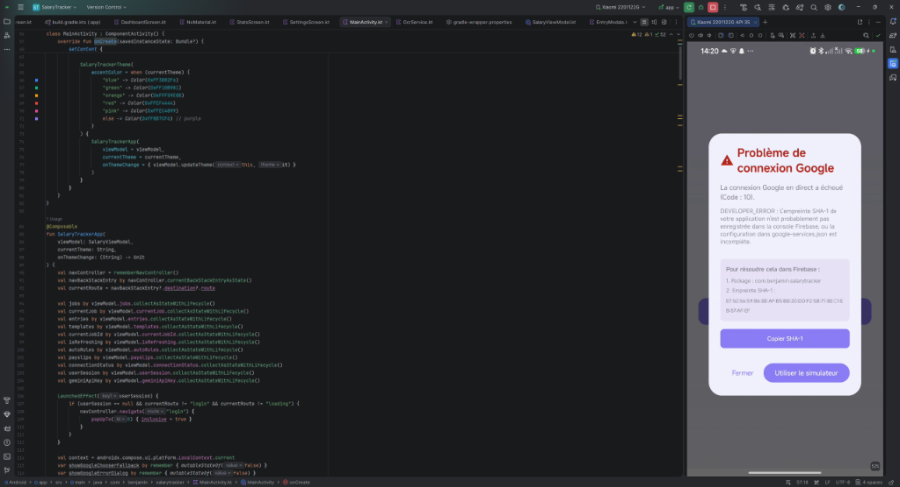
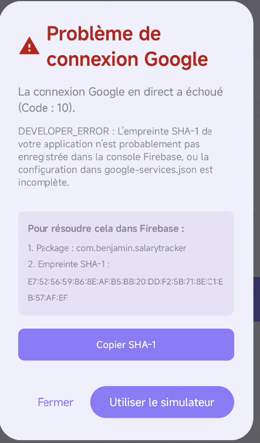
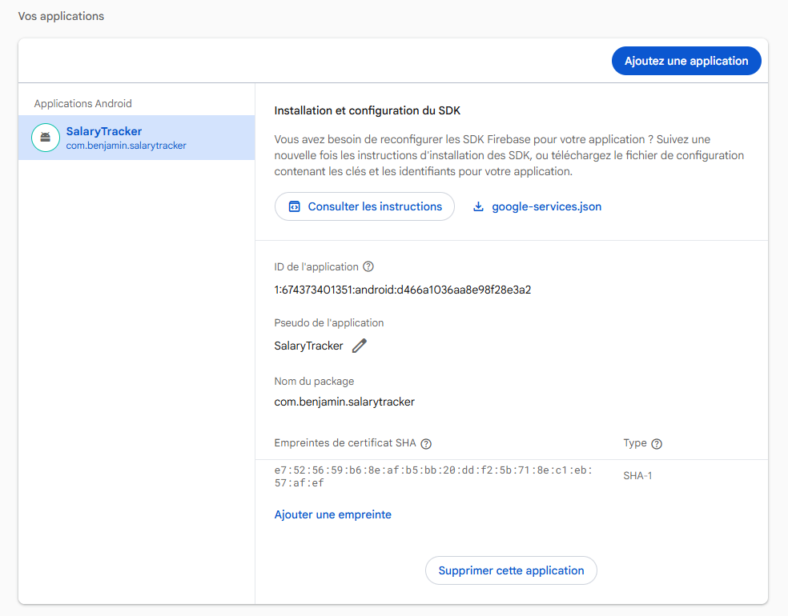

# SalaryTracker ⏰

**SalaryTracker** est une application Android moderne et performante conçue pour suivre vos heures de travail, estimer votre salaire mensuel (brut et net) en temps réel, et comparer ces estimations avec vos bulletins de paie réels pour détecter tout écart ou sous-paiement. 

L'application intègre des technologies d'Intelligence Artificielle (Gemini API) pour faciliter la saisie automatique à partir de notes ou d'importation de documents, le tout enveloppé dans une interface utilisateur fluide, animée et haut de gamme.

---

## 📸 Captures d'écran

<p align="center">
  
  
  
</p>

<p align="center">
  
  
  
</p>

---

## 🚀 Fonctionnalités Clés

*   **📅 Calendrier Mensuel Interactif** : Visualisez d'un seul coup d'œil vos journées travaillées et vos congés sous forme de grille mensuelle interactive. Cliquez sur n'importe quel jour pour ajouter ou modifier une saisie en quelques secondes.
*   **📊 Comparatif Estimé vs Réel** : Importez vos bulletins de paie (images ou PDF) grâce au scanner intelligent par IA (Gemini). L'application compare automatiquement le net payé avec vos heures saisies et affiche un panneau de comparaison détaillé (heures, brut, net) avec des alertes visuelles en cas de sous-paiement potentiel.
*   **💼 Module Multi-Contrats / Archivage** : Suivez plusieurs emplois simultanément ou conservez l'historique de vos anciens jobs. Les contrats terminés peuvent être archivés pour garder un écran d'accueil épuré.
*   **🔔 Rappels Quotidiens Intelligents** : Recevez une notification locale à l'heure de votre choix en fin de journée uniquement si vous avez oublié de saisir vos heures aujourd'hui.
*   **🤖 Importateur par Intelligence Artificielle** : Importez vos heures depuis des fichiers CSV, des tableaux Excel, ou même à partir d'une simple note manuscrite rédigée en texte libre grâce au traitement automatique par IA.
*   **🔒 Authentification Google & Mode Simulation** : Connectez-vous de manière sécurisée via votre compte Google (avec synchronisation Cloud en temps réel sur Firebase) ou utilisez le mode simulateur local pour tester l'application instantanément sans compte.

---

## 🛠️ Stack Technique

*   **Langage** : Kotlin
*   **UI Framework** : Jetpack Compose (Material 3) avec animations fluides de transition et d'onboarding.
*   **Base de données & Auth** : Firebase (Authentication & Realtime Database) pour une synchronisation multi-appareils fluide et sécurisée.
*   **Intelligence Artificielle** : Google Gemini API (via SDK Client officiel) pour l'OCR de fiches de paie et la structuration des saisies libres.
*   **Architecture** : MVVM (Model-View-ViewModel) robuste avec gestion d'état réactive (StateFlow/Lifecycle).

---

## 📦 Compilation & Installation locale

### Prérequis
- Java JDK 17+
- Android SDK (API 26+)

### Compiler l'APK de Test (Optimisé)
Vous pouvez générer une version Release optimisée (minifiée par R8/Proguard pour éliminer tout lag d'animation) et signée automatiquement avec la clé debug de développement :

```bash
./gradlew assembleRelease
```
L'APK généré sera disponible sous :
`app/build/outputs/apk/release/app-release.apk`

---

## 🔑 Configuration pour la publication (Play Store)

Pour signer l'application avec vos clés de production privées, configurez le fichier `keystore.properties` à la racine du projet :

1. Créez un fichier `keystore.properties` à la racine :
    ```properties
    storeFile=../chemin_de_votre_cle.jks
    storePassword=votre_mot_de_passe_keystore
    keyAlias=votre_alias_de_cle
    keyPassword=votre_mot_de_passe_de_cle
    ```
2. Lancez la compilation de l'App Bundle :
    ```bash
    ./gradlew bundleRelease
    ```
3. Récupérez le bundle sous `app/build/outputs/bundle/release/app-release.aab` et déposez-le sur votre console Google Play.

---

## 📄 Licence

Ce projet est distribué sous licence libre d'utilisation à des fins de test et de formation.
